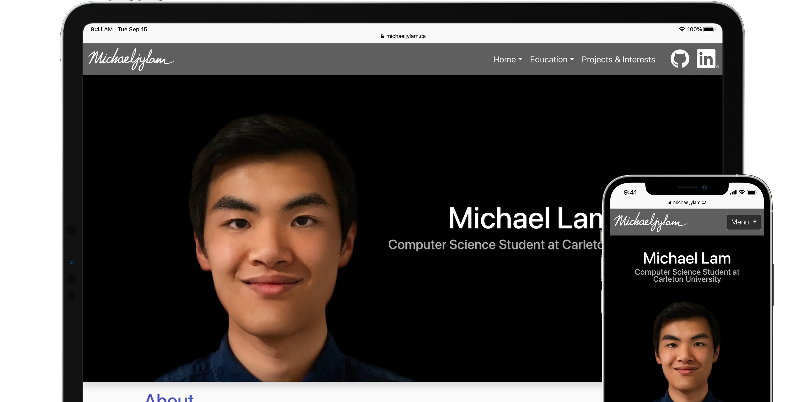
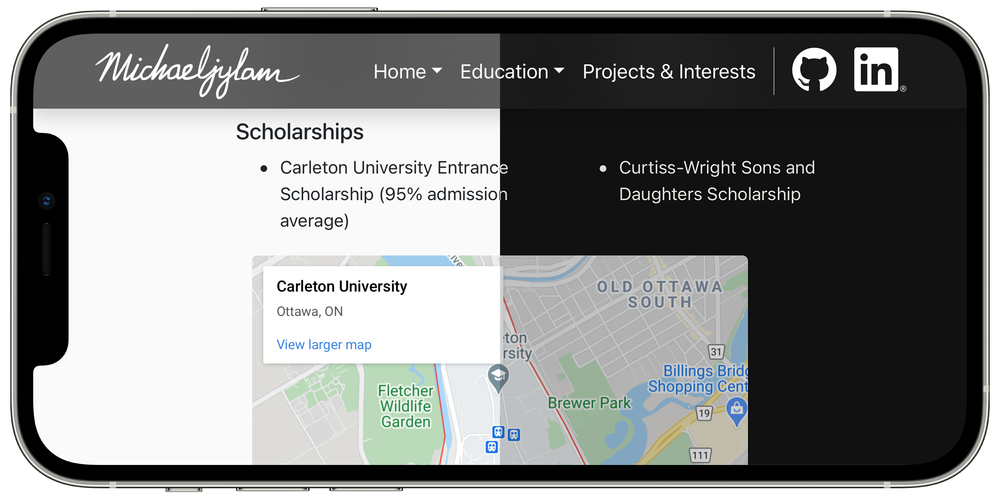
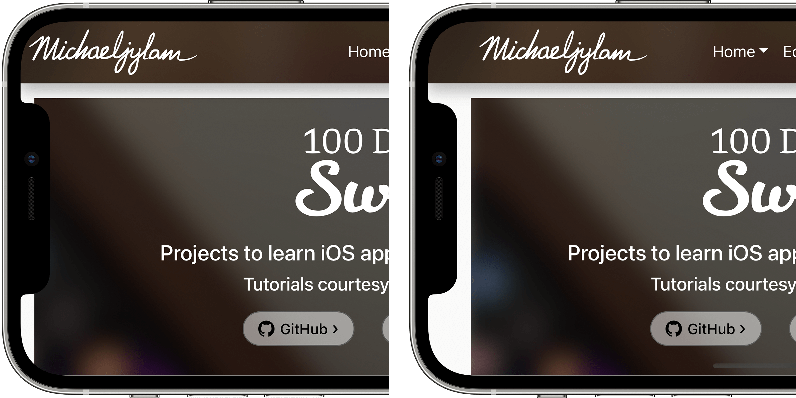

# michaeljylam.ca
Built upon the foundation of the Bootstrap library, this portfolio website hosts a detailed résumé and an overview of all projects. Serving also as a platform for experimentation with web features, this website integrates a mobile-friendly design, support for system-wide dark mode, and support for devices with a notch design.

## Features
### Responsive Design

### Support for System-wide Dark Mode

### Support for Devices with a Notch Design

